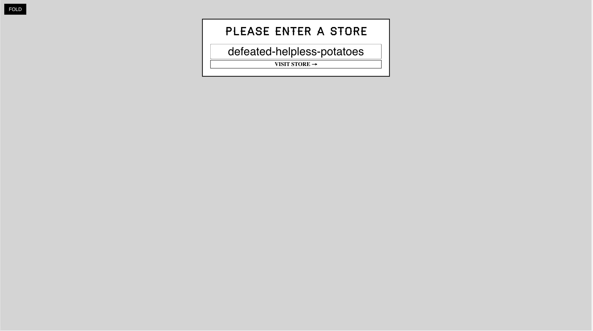
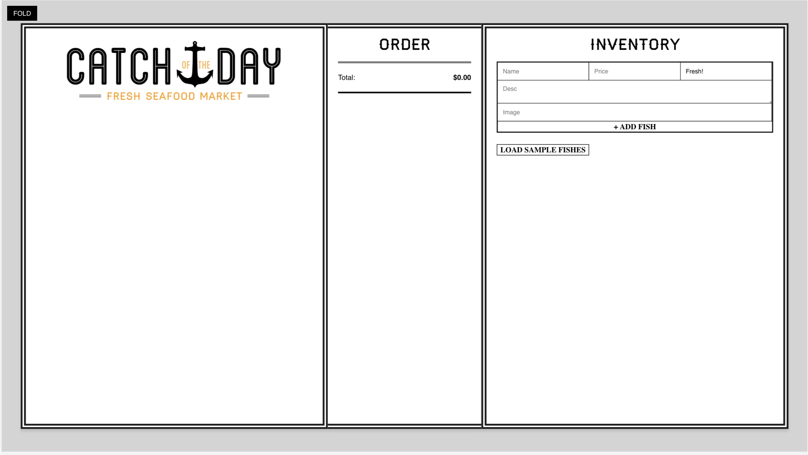
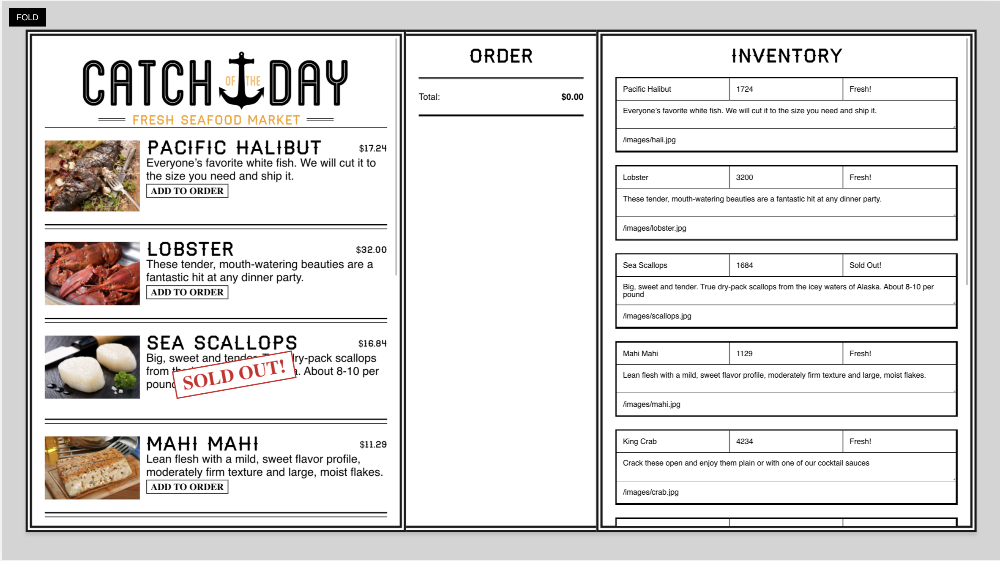
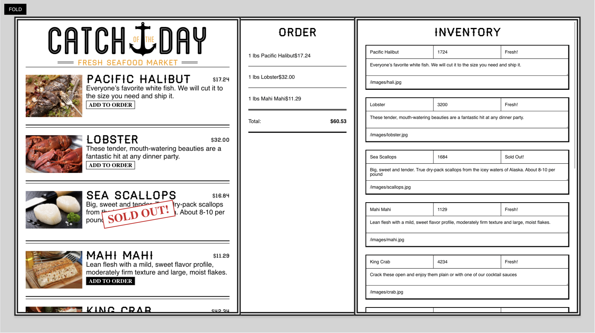

# Catch Of The Day

## Description

It's a Fresh Market project where you can see available fish to buy. You can add to order and see your order list. Also you can your own fish to the list with its name, price, availibility, description, and image.

## How to use

You can simply clone this repository and open it in your favorite IDE. At the root, install the required packages by typing `npm i or npm install` and after that, write `npm start` in the terminal to start the project.
I hope you enjoy it.

Screenshots:
  
  
  
  

## Contact

In case of any question, feel free to contact me through one of below options:

- Through Github: [@iqbalahmadi](https://github.com/iqbalahmadi)
- Via Email: iqb.ahmadi@gmail.com
